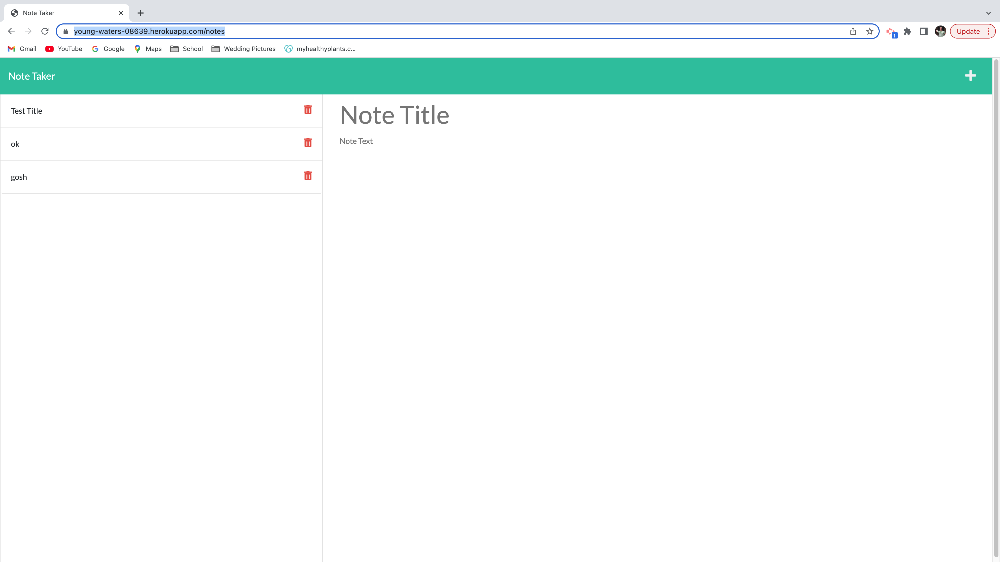

  # Note Taker
## This is an easy to use note taking app that allows you to write and save notes. It allows you to organize your thoughts and keep track of the tasks that you need to complete. Your existing notes will appear on the left-hand column, and when you add and save a new note it will be placed there as well. When you click on a note in the left-hand column, it will be displayed  in the right-hand column.
  
## Badge: []

Author: MrPerry

## Table of Contents:
- [username](#username),
- [profile](#profile),
- [email](#email),
- [installation](#installation),
- [usage](#usage),
- [license](#license),
- [contributors](#contributors),
- [test](#test),
- [author](#author),
- [questions](#questions),

## Installation
In the terminal use 'npm i' to install the dependencies 

## Usage
After installing the dependencies, go to the deployed Heroku link available in this README.md to enjoy all the note taking you would like to do without any wasted paper

## Heroku app deployment https://young-waters-08639.herokuapp.com/

## Link to demonstration:
https://drive.google.com/file/d/1srm7PIEE2WJK66bWfL5SXMviJcDLgYhF/view
## Contributors
MrPerry

## License
### MIT
### link: (https://opensource.org/licenses/MIT)

## Test

## Questions
### If you have any questions, contact me at:

#### GitHub Username: [MrPerry365]

#### GitHub Profile: [https://github.com/MrPerry365/noteTaker.git]

#### Email Address: [1987nowhere@gmail.com]

